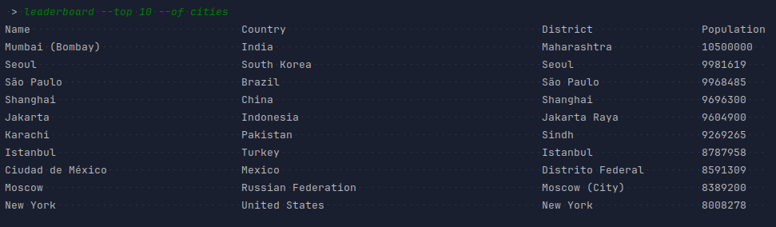

# SET08103 - Software Engineering Methods

[](https://www.napier.ac.uk/)

## Team 3 Project Repository

[](https://github.com/2004seraph/SET08103/actions?query=branch%3Amaster)
[](https://github.com/2004seraph/SET08103/actions?query=branch%3Adevelop)
[](https://github.com/2004seraph/SET08103/blob/master/LICENSE)
[](https://github.com/2004seraph/SET08103/releases)
[](https://codecov.io/gh/2004seraph/SET08103)

## Usage

> [!IMPORTANT]
> You may want to read this if you're an examiner.

> [!NOTE]
> Assume common UNIX-like CLI tool behaviour

These commands assume a Linux environment with Docker and Maven installed.

1. Package the app: `mvn -DskipTests package`
2. Start the database Docker container using a config which allows the app to be run outside it's Docker container: 

   `docker compose -f docker-compose.yml -f docker-compose.dev.linux.yml up db`

    Or if you want to run on a Windows environment:    

   `docker compose -f docker-compose.yml -f docker-compose.windows.linux.yml up db`
3. Open an interactive REPL prompt: `MYSQL_ROOT_PASSWORD=root java -jar target/pop.jar` (ensuring zero arguments)
4. Ask for help with the commands: `help`
5. Run your query and see the output! You will be able to fulfil any requirement (and more!) using the commands in the prompt.

You can also directly evaluate commands from the shell by passing them to the package as command line arguments:

```
~ $ MYSQL_ROOT_PASSWORD=root java -jar target/pop.jar total --in world
Successfully connected to MySQL database: world

Population of World: 6078749450
```

## Requirements

> **31** requirements of **32** have been implemented, which is **96.9%**.

### Evidence

> [!NOTE]
> Very long results have been reduced to the beginning and ending dozen or so. 

> [!NOTE]
> The command has been included for you to reproduce each screenshot. Bear in mind they were all ran in the package's interactive REPL mode.

| ID | Name                                                                                                                                                     | Met | Screenshot                                                                                                                  |
|----|----------------------------------------------------------------------------------------------------------------------------------------------------------|-----|-----------------------------------------------------------------------------------------------------------------------------|
| 1  | All the countries in the world organised by largest population to smallest.                                                                              | Yes | <br/>   |
| 2  | All the countries in a continent organised by largest population to smallest.                                                                            | Yes | <br/>   |
| 3  | All the countries in a region organised by largest population to smallest.                                                                               | Yes |                                                                     |
| 4  | The top `N` populated countries in the world where `N` is provided by the user.                                                                          | Yes |                                                                     |
| 5  | The top `N` populated countries in a continent where `N` is provided by the user.                                                                        | Yes |                                                                     |
| 6  | The top `N` populated countries in a region where `N` is provided by the user.                                                                           | Yes |                                                                     |
| 7  | All the cities in the world organised by largest population to smallest.                                                                                 | Yes | <br/>   |
| 8  | All the cities in a continent organised by largest population to smallest.                                                                               | Yes | <br/>   |
| 9  | All the cities in a region organised by largest population to smallest.                                                                                  | Yes | <br/>   |
| 10 | All the cities in a country organised by largest population to smallest.                                                                                 | Yes | <br/> |
| 11 | All the cities in a district organised by largest population to smallest.                                                                                | Yes |                                                                    |
| 12 | The top `N` populated cities in the world where `N` is provided by the user.                                                                             | Yes |                                                                    |
| 13 | The top `N` populated cities in a continent where `N` is provided by the user.                                                                           | Yes |                                                                    |
| 14 | The top `N` populated cities in a region where `N` is provided by the user.                                                                              | Yes |                                                                    |
| 15 | The top `N` populated cities in a country where `N` is provided by the user.                                                                             | Yes |                                                                    |
| 16 | The top `N` populated cities in a district where `N` is provided by the user.                                                                            | Yes |                                                                    |
| 17 | All the capital cities in the world organised by largest population to smallest.                                                                         | Yes | <br/> |
| 18 | All the capital cities in a continent organised by largest population to smallest.                                                                       | Yes | <br/> |
| 19 | All the capital cities in a region organised by largest to smallest.                                                                                     | Yes |                                                                    |
| 20 | The top `N` populated capital cities in the world  where `N` is provided by the user.                                                                    | Yes |                                                                    |
| 21 | The top `N` populated capital cities in a continent where `N` is provided by the user.                                                                   | Yes |                                                                    |
| 22 | The top `N` populated capital cities in a region where `N` is provided by the user.                                                                      | Yes |                                                                    |
| 23 | The population of people, people living in cities, and people not living in cities in each continent.                                                    | Yes |                                                                    |
| 24 | The population of people, people living in cities, and people not living in cities in each region.                                                       | Yes |                                                                    |
| 25 | The population of people, people living in cities, and people not living in cities in each country.                                                      | Yes | <br/> |
| 26 | The population of the world.                                                                                                                             | Yes |                                                                    |
| 27 | The population of a continent.                                                                                                                           | Yes |                                                                    |
| 28 | The population of a region.                                                                                                                              | Yes |                                                                    |
| 29 | The population of a country.                                                                                                                             | Yes |                                                                    |
| 30 | The population of a district.                                                                                                                            | Yes |                                                                    |
| 31 | The population of a city.                                                                                                                                | Yes |                                                                    |
| 32 | The number of people who speak Chinese, English, Hindi, Spanish, and Arabic, from greatest to smallest, including the percentage of the world population | No  |                                                                                                                             |

## Coverage

Each square is a file, color-coded to how much of it is being tested.


## Dev Notes

- The `.env` file stores some repeated variables for the build process for the docker containers
- The `./build.sh` file simply builds the Maven project, then builds the docker containers
  - You can run the file from your command line by typing `./build.sh`
- The `./start.sh` file starts the entire project, it works similarly to above, and will build the project if it needs
to, but if you edit it, you will need to rerun `./build.sh`
- To completely reset all the docker containers, run: `docker compose rm`, and select "Yes"
- Changing `MYSQL_ROOT_PASSWORD` requires `docker compose rm` to be ran